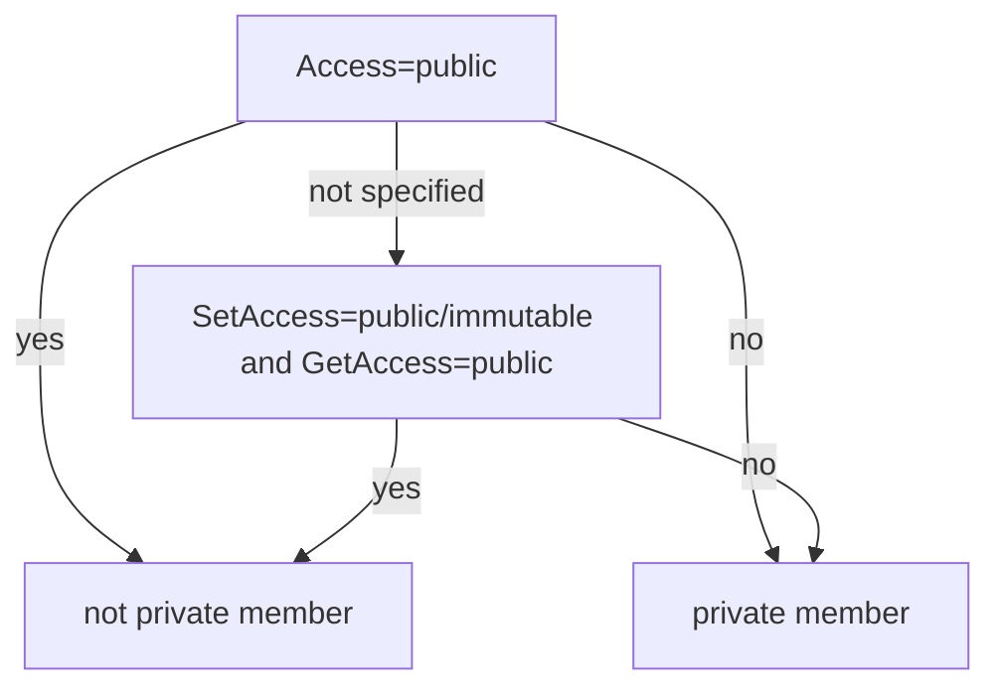

# Members options

## `members`

- **:octicons-package-24: Type <code><autoref identifier="list" optional>list</autoref>[<autoref identifier="str" optional>str</autoref>] |
    <autoref identifier="bool" optional>bool</autoref> | None</code>  :material-equal: `None`{ title="default value" }**
<!-- - **:octicons-project-template-24: Template :material-null:** (N/A) -->

An explicit list of members to render.

Only members declared in this list will be rendered. A member without a docstring will still be rendered, even if [`show_if_no_docstring`][] is set to false.

The members will be rendered in the specified order, regardless of the value of [`members_order`][]. **Note that members will still be grouped by category, according to the [`group_by_category`][] option.**

Passing a falsy value (`no`, `false` in YAML) or an empty list (`[]`) will tell the MATLAB handler not to render any member. Passing a truthy value (`yes`, `true` in YAML) will tell the MATLAB handler to render every member.

Any given value, except for an explicit `None` (`null` in YAML) will tell the handler to ignore [`filters`][] for the object's members. Filters will still be applied to the next layers of members (grand-children).

```yaml title="in mkdocs.yml (global configuration)"
plugins:
- mkdocstrings:
    handlers:
      matlab:
        options:
          members:
          - hello  # (1)
```

1. :warning: Most of the time it won't make sense to use this option at the global level.

```md title="or in docs/some_page.md (local configuration)"
::: +mymembers
    options:
      members:
      - ThisClass
      - this_function
```

--8<-- "docs/snippets/+mymembers/mymembers.md"

!!! preview

    === "With `members: true`"

        ::: +mymembers
            options:
              members: true

    === "With `members: false` or `members: []`"

        ::: +mymembers
            options:
              members: false

    === "With `members: [ThisClass]`"

        ::: +mymembers
            options:
              members: [ThisClass]


!!! info

    The default behavior (with unspecified `members` or `members: null`) is to use [`filters`][].

## `hidden_members`

- **:octicons-package-24: Type <code><autoref identifier="list" optional>list</autoref>[<autoref identifier="str" optional>str</autoref>] |
    <autoref identifier="bool" optional>bool</autoref></code>  :material-equal: `False`{ title="default value" }**
<!-- - **:octicons-project-template-24: Template :material-null:** (N/A) -->

MATLAB's [classes](https://mathworks.com/help/matlab/matlab_oop/class-attributes.html), [methods](https://mathworks.com/help/matlab/matlab_oop/method-attributes.html) and [properties](https://mathworks.com/help/matlab/matlab_oop/property-attributes.html) can be hidden by setting its attributes to `Hidden` or `Hidden=true`. By default, members that are specified as hidden will not be documented. 

This takes precedence over [`members`][] and [`filters`][], and also applies for [`inherited_members`][]. This means that for any hidden member to be shown, `hidden_members` must be enabled, and further selection is possible via [`members`][] and [`filters`][]. Hidden members will be labeled `Hidden`, this can be disabled in [`show_labels`][]. 

```yaml title="in mkdocs.yml (global configuration)"
plugins:
- mkdocstrings:
    handlers:
      matlab:
        options:
          hidden_members: true
```

```md title="or in docs/some_page.md (local configuration)"
::: mymembers.ThisClass
    options:
      hidden_members: true
```

--8<-- "docs/snippets/+mymembers/mymembers.md"

!!! preview

    === "With `hidden_members: true`"

        ::: mymembers.ThisClass
            options:
              hidden_members: true

    === "With `hidden_members: false` or `hidden_members: []`"

        ::: mymembers.ThisClass
            options:
              hidden_members: false

    === "With `hidden_members: ['hidden_method']`"

        ::: mymembers.ThisClass
            options:
              hidden_members: ['hidden_method']

## `private_members`

- **:octicons-package-24: Type <code><autoref identifier="list" optional>list</autoref>[<autoref identifier="str" optional>str</autoref>] |
    <autoref identifier="bool" optional>bool</autoref></code>  :material-equal: `False`{ title="default value" }**
<!-- - **:octicons-project-template-24: Template :material-null:** (N/A) -->

MATLAB's [methods](https://mathworks.com/help/matlab/matlab_oop/method-attributes.html) and [properties](https://mathworks.com/help/matlab/matlab_oop/property-attributes.html) can be set to private via the `Access` attribute, and additionally via the `SetAccess` and `GetAccess` attributes for properties. The possible settings for these attributes are 

1. *public*
2. *protected*
3. *private*
4. *immutable* (only for `SetAccess`)
5. List of classes that have access to the current method or property. 

To simplify the definition here, any property or method that do not have attribute `Access` set to *public* is considered a private member. If the `GetAccess` and/or `SetAccess` attribute is set in stead of `Access` for a property, it is consisered a private member if either the `SetAccess` attribute is not *public* or *immutable* or if the `GetAccess` attribute is not *public*. 



This takes precedence over [`members`][] and [`filters`][], and also applies for [`inherited_members`][]. This means that for any private member to be shown, `private_members` must be enabled, and further selection is possible via [`members`][] and [`filters`][]. Private members will be labeled with it access attribute setting, this can be disabled in [`show_labels`][]. 

```yaml title="in mkdocs.yml (global configuration)"
plugins:
- mkdocstrings:
    handlers:
      matlab:
        options:
          private_members: true
```

```md title="or in docs/some_page.md (local configuration)"
::: mymembers.ThisClass
    options:
      private_members: true
```

--8<-- "docs/snippets/+mymembers/mymembers.md"

!!! preview

    === "With `private_members: true`"

        ::: mymembers.ThisClass
            options:
              private_members: true

    === "With `private_members: false` or `private_members: []`"

        ::: mymembers.ThisClass
            options:
              private_members: false

    === "With `private_members: ['private_property']`"

        ::: mymembers.ThisClass
            options:
              private_members: ['private_property']

## `inherited_members`

- **:octicons-package-24: Type <code><autoref identifier="list" optional>list</autoref>[<autoref identifier="str" optional>str</autoref>] |
    <autoref identifier="bool" optional>bool</autoref></code>  :material-equal: `False`{ title="default value" }**
<!-- - **:octicons-project-template-24: Template :material-null:** (N/A) -->

An explicit list of inherited members (for classes) to render.

Inherited members are always fetched from classes that are in the same namespace as the currently rendered class. Otherwise, it must be ensured that the paths to the parent is included in [paths](../index.md#paths). This is also the case for MATLAB built-in classes. 

Passing a falsy value (`no`, `false` in YAML) or an empty list (`[]`) will tell the MATLAB handler not to render any inherited member. Passing a truthy value (`yes`, `true` in YAML) will tell the MATLAB handler to render every inherited member.

When all inherited members are selected with `inherited_members: true`, it is possible to specify both members and inherited members in the `members` list:

```yaml
inherited_members: true
members:
- inherited_member_a
- inherited_member_b
- member_x
- member_y
```

The alternative is not supported:

```yaml
inherited_members:
- inherited_member_a
- inherited_member_b
members:
- member_x
- member_y
```

...because it would make members ordering ambiguous/unspecified.

You can render inherited members *only* by setting `inherited_members: true` (or a list of inherited members) and setting `members: false`:

```yaml
inherited_members: true
members: false
```

```yaml
inherited_members:
- inherited_member_a
- inherited_member_b
members: false
```

You can render *all declared members* and all or specific inherited members by leaving `members` as null (default):

```yaml
inherited_members:
- inherited_member_a
- inherited_member_b
# members: null  # (1)
```

1. In this case, only declared members will be subject to further filtering with [`filters`][filters] and [`docstrings`][show_if_no_docstring].

```yaml
inherited_members: true  # (1)
# members: null
```

1. In this case, both declared and inherited members will be subject to further filtering with [`filters`][filters] and [`docstrings`][show_if_no_docstring].

You can render *all declared members* and all or specific inherited members, avoiding further filtering with [`filters`][filters] and [`docstrings`][show_if_no_docstring] by setting `members: true`:

```yaml
inherited_members: true
members: true
```

```yaml
inherited_members:
- inherited_member_a
- inherited_member_b
members: true
```

The general rule is that declared or inherited members specified in lists are never filtered out.

```yaml title="in mkdocs.yml (global configuration)"
plugins:
- mkdocstrings:
    handlers:
      matlab:
        options:
          inherited_members: false
```

```md title="or in docs/some_page.md (local configuration)"
::: mymembers.ThisClass
    options:
      inherited_members: true
```

--8<-- "docs/snippets/+mymembers/mymembers.md"

!!! preview

    === "With inherited members"

        ::: mymembers.ThisClass
            options:
              inherited_members: true

    === "Without inherited members"

        ::: mymembers.ThisClass
            options:
              inherited_members: false

## `members_order`

- **:octicons-package-24: Type [`str`][] :material-equal: `"alphabetical"`{ title="default value" }**
<!-- - **:octicons-project-template-24: Template :material-null:** (N/A) -->

The members ordering to use. Possible values:

- `alphabetical`: order by the members names.
- `source`: order members as they appear in the source file.

The order applies for all members, recursively.
The order will be ignored for members that are explicitely sorted using the [`members`][] option.
**Note that members will still be grouped by category,
according to the [`group_by_category`][] option.**

```yaml title="in mkdocs.yml (global configuration)"
plugins:
- mkdocstrings:
    handlers:
      matlab:
        options:
          members_order: alphabetical
```

```md title="or in docs/some_page.md (local configuration)"
::: mymembers.ThisClass
    options:
      members_order: source
```

--8<-- "docs/snippets/+mymembers/mymembers.md"

!!! preview

    === "With alphabetical order"

        ::: mymembers.ThisClass
            options:
              members_order: alphabetical

    === "With source order"

        ::: mymembers.ThisClass
            options:
              members_order: source

## `filters`

- **:octicons-package-24: Type <code><autoref identifier="list" optional>list</autoref>[<autoref identifier="str" optional>str</autoref>] | None</code>  :material-equal: `["!^delete$|^disp$"]`{ title="default value" }**
<!-- - **:octicons-project-template-24: Template :material-null:** (N/A) -->

A list of filters applied to filter objects based on their name.

Filters are regular expressions. These regular expressions are evaluated by Python and so must match the syntax supported by the [`re`][] module. A filter starting with `!` (negative filter) will exclude matching objects instead of including them.

The default value (`[!^delete$|^disp$]`) means: *render every object, except for members that are named [`delete`](https://mathworks.com/help/matlab/matlab_oop/handle-class-destructors.html) or [`disp`](https://mathworks.com/help/matlab/matlab_oop/displaying-objects-in-the-command-window.html), which are two of MATLAB classes' built-in methods. 

Each filter takes precedence over the previous one. This allows for fine-grain selection of objects by adding more specific filters. For example, you can start by unselecting objects that start with `_`, and add a second filter
that re-select objects that start with `__`. The default filters can therefore be rewritten like this:

```yaml
filters:
- "!^_"
- "^__"
```

If there are no negative filters, the handler considers that everything is **unselected** first, and then selects things based on your positive filters. If there is at least one negative filter, the handler considers that everything is **selected** first, and then re-selects/unselects things based on your other filters. In short, `filters: ["a"]` means *"keep ***nothing*** except names containing `a`"*, while `filters: ["!a"]` means *"keep ***everything*** except names containing `a`"*.

An empty list of filters tells the MATLAB handler to render every object. The [`members`][] option takes precedence over filters (filters will still be applied recursively to lower members in the hierarchy).

```yaml title="in mkdocs.yml (global configuration)"
plugins:
- mkdocstrings:
    handlers:
      matlab:
        options:
          filters:
          - "!^delete$|^disp$"
```

```md title="or in docs/some_page.md (local configuration)"
::: matlab_callable
    options:
      filters: []
```

--8<-- "docs/snippets/+mymembers/mymembers.md"

!!! preview

    === "With `filters: []`"

        ::: mymembers.ThisClass
            options:
              filters: []

    === "With `filters: ["method"]`"

        ::: mymembers.ThisClass
            options:
              filters: ["method"]

    === "With `filters: ["!method"]`"

        ::: mymembers.ThisClass
            options:
              filters: ["!method"]


## `show_labels`

- **:octicons-package-24: Type [`bool`][] :material-equal: `True`{ title="default value" }**
<!-- - **:octicons-project-template-24: Template :material-null:** (N/A) -->

Whether to show labels of the members.

```yaml title="in mkdocs.yml (global configuration)"
plugins:
- mkdocstrings:
    handlers:
      matlab:
        options:
          show_labels: true
```

```md title="or in docs/some_page.md (local configuration)"
::: mymembers.ThisClass
    options:
      show_labels: false
```

--8<-- "docs/snippets/+mymembers/mymembers.md"

!!! preview

    === "With show labels"

        ::: mymembers.ThisClass
            options:
              private_members: true
              show_labels: true

    === "Without show labels"

        ::: mymembers.ThisClass
            options:
              private_members: true
              show_labels: false